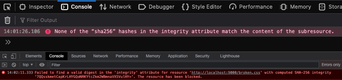

# Capturing invalid sub-resource integrity (SRI) errors on the client

[](https://www.repostatus.org/#wip)

When <abbr title="sub-resource integrity">SRI</abbr> are invalid, is a Javascript detection method/API we can use to 
ensure the asset has loaded and that they haven't thrown an error? I have posed this question to 
the fine folks on StackOverflow: ["Is it possible to log client-side sub-resource integrity errors with javascript?"](https://stackoverflow.com/questions/69320904/is-it-possible-to-log-client-side-sub-resource-integrity-errors-with-javascript)



## Solution

Use the element `onerror` event handler, from there you can do some additional checks to rule 
out some common errors before suggesting it might be an SRI issue. You can never be 100% that it 
is an SRI issue.

This library is in development to simplify the process of monitoring SRI violations.

## Usage

```html
<script src="lib/sri-monitor.js"></script>
<script
  src="https://example.com/lib/you/want/to/monitor.js"
  integrity="sha256-xxxxxx" 
  onerror="monitorForSriError(this)" />
```
